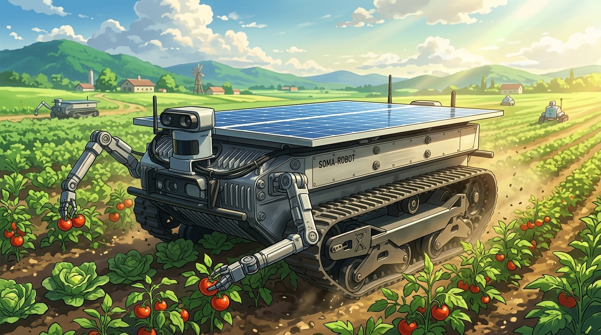
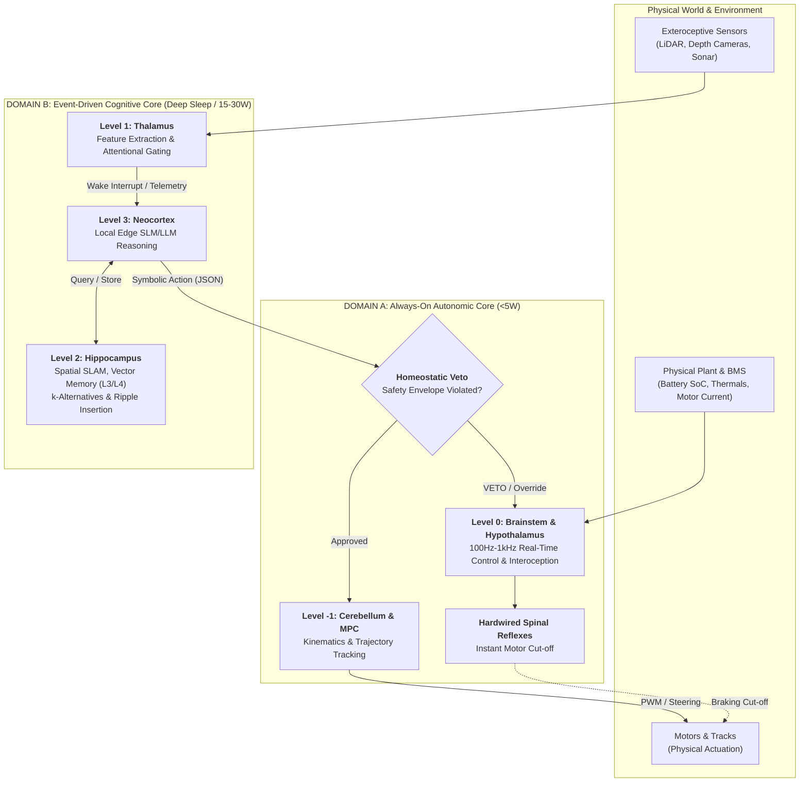

# SOMA-Robot: Autonomic Biomimetic Robotics via Homeostatic Regulation

[](LICENSE)
[](#system-architecture)
[](#the-soma-protocol)
[](#roadmap)
[](#ethical-considerations--dual-use-statement)

> **"Every good regulator of a system must be a model of that system."**  
> — Conant & Ashby (1970)

**SOMA-Robot** is an architectural blueprint and engineering specification for an **indefinite-endurance autonomous terrestrial agent**. 

Unlike conventional robotics that relies on power-hungry, continuous-compute models (which exhaust battery reserves in under an hour), SOMA-Robot unifies:
1. **Biological Subsumption & Homeostasis:** Survival drives (energy, thermal state, mechanical pain) run at high frequency on ultra-low-power microcontrollers and hold absolute veto power over cognitive layers.
2. **The SOMA Agentic Protocol:** A "dumb orchestrator, sovereign LLM" framework where executive reasoning is treated as an event-driven, energy-budgeted resource with tiered L1–L4 memory and an immutable flight recorder.
3. **Cybernetic Plant Grounding:** Resolving the *Orphan Regulator* pathology of disembodied language models by anchoring cognitive representations to a physical plant with real, irreversible self-preservation stakes.
4. **Solar REM Consolidation ("Dream Phase"):** Autonomous solar harvesting cycles ("pasturing") coupled with offline episodic memory distillation and policy tuning when solar irradiance yields an energy surplus.

<p align="center">
  
  <br>
  <em>Figure 1: SOMA-Robot architectural concept — An indefinite-endurance terrestrial rover featuring dorsal monocrystalline PV arrays, continuous rubber tracks, sealed IP67 avionics hull, and sensor turret in solar pasturing stance.</em>
</p>

---

## High-Level Cognitive Architecture

```
═══════════════════════════════════════════════════════════════════════════
 LEVEL 3: NEOCORTEX (Executive Planning & Reasoning)
 [Event-Driven Local SLM/LLM (3B-8B Quantized) on Edge NPU/GPU]
 - Abstract task decomposition, causal problem solving, human dialogue.
 - Operates strictly via asynchronous semantic JSON tool calls.
 - Sleeps when tasks are routine; awakens upon sensory anomalies.
───────────────────────────────────────────────────────────────────────────
 LEVEL 2: HIPPOCAMPUS (Spatial & Episodic Memory)
 [Topological SLAM + Local Vector Store (RAG) + SOMA L3/L4 Memory]
 - Maintains metric/topological maps and historical event memories.
 - Tour planning via k-Alternatives; sub-ms dynamic insertion via Ripple Insertion.
 - Records failure-modes: "Sloped terrain X caused track slip at 20% battery".
───────────────────────────────────────────────────────────────────────────
 LEVEL 1: THALAMUS (Sensory Filtering & Attentional Gating)
 [Ultra-Lightweight Vision (YOLO-Nano / Feature Extractors) + Sensor Fusion]
 - Compresses high-bandwidth exteroception (RGB-D, LiDAR, Sonar) into symbols.
 - Gating logic: Suppresses redundant noise; issues wake interrupts to Cortex.
───────────────────────────────────────────────────────────────────────────
 LEVEL 0: BRAINSTEM & HYPOTHALAMUS (Interoception & Homeostatic Veto)
 [Always-On Sub-5W Microcontroller / Real-Time Core (C++ / Rust)]
 - 100 Hz - 1 kHz hardware control loop: Battery SoC, thermals, stall currents.
 - Hardwired spinal reflexes: Immediate motor cut-off on mechanical collision.
 - ABSOLUTE VETO: Overrides LLM commands when survival drives are violated.
───────────────────────────────────────────────────────────────────────────
 LEVEL -1: CEREBELLUM & MOTOR CORTEX (Kinematics & Proprioception)
 [Model Predictive Control (MPC) / PID Controllers / Motor Encoders]
 - Executes fine trajectory tracking and obstacle avoidance.
 - The LLM NEVER drives PWM motors directly; it emits symbolic targets.
═══════════════════════════════════════════════════════════════════════════
```

### Operational Subsystem Dataflow & Homeostatic Veto Loop



---

## Repository Structure

```text
soma-robot/
├── README.md                           # Project manifesto and system overview
├── assets/
│   └── soma_robot_concept.jpg          # Physical platform concept render
├── docs/
│   ├── 01_SYSTEM_ARCHITECTURE.md       # Full hardware, compute, and cognitive specification
│   ├── 02_CYBERNETIC_HOMEOSTASIS.md     # Conant-Ashby loop, interoception, and drive dynamics
│   ├── 03_SOMA_PROTOCOL_AND_MEMORY.md   # L1-L4 memory hierarchy and immutable audit ledger
│   ├── 04_SOLAR_CONSOLIDATION_CYCLE.md  # Day/Night cycles, pasture mode, and solar REM dreaming
│   └── 05_DEVELOPMENT_ROADMAP.md        # Three-phase validation (Logic -> Sim -> Scale 1:10)
├── schemas/
│   ├── sensory_telemetry.json          # Thalamus/Hypothalamus -> Cortex payload schema
│   ├── executive_command.json          # Cortex -> Cerebellum/Hippocampus tool-call schema
│   └── audit_event.json                # SOMA Append-Only Flight Recorder schema
└── simulation/
    └── README.md                       # Phase 0 mental simulator specifications
```

---

## Core Innovations

### 1. Resolving the "Orphan Regulator" Pathology
Recent mechanistic evaluations (Tagliabue, Dung & Berg, 2026, *The Pain Axis*) demonstrate that activating "pain" or "self-harm" vectors in disembodied LLMs does not yield self-preservation; instead, it acts as a toxic semantic attractor, inducing self-sabotage and weight deletion. In SOMA-Robot, pain and hunger are grounded in a **real cybernetic plant** (battery voltage, motor current draw, thermal envelopes). Pain restores its evolutionary purpose: immediate homeostatic negative feedback that enforces physical survival.

### 2. Heterogeneous Asymmetric Computing
Conventional autonomous robots run heavy computing stacks continuously, wasting energy even when stationary. SOMA-Robot separates compute into:
* **Autonomic Core (Always-On, <5W):** Handles sensor sampling, safety boundaries, reflex braking, and battery management.
* **Cognitive Core (Event-Driven, 15–30W):** Put into deep sleep; awakened only when the Thalamus detects an unhandled anomaly or when high-level re-planning is required.

### 3. The Solar REM Sleep Cycle
When stationary under high solar irradiance with batteries above 80%, SOMA-Robot enters an autonomous **Consolidation Phase**:
* The executive LLM analyzes episodic memory traces from recent operations.
* Discards uninformative sensory logs, updates topological graph costs, and distills experience into compact associative heuristics.

---

## Documentation Quick Links

* [**01. System Architecture**](docs/01_SYSTEM_ARCHITECTURE.md) — Comprehensive technical blueprint, dual-compute bus, and subsystem interfaces.
* [**02. Cybernetic Homeostasis**](docs/02_CYBERNETIC_HOMEOSTASIS.md) — Mathematical and biological formalization of survival drives and the veto mechanism.
* [**03. SOMA Protocol & Memory**](docs/03_SOMA_PROTOCOL_AND_MEMORY.md) — Strict JSON typing, L1–L4 memory architecture, and flight recorder telemetry.
* [**04. Solar Consolidation Cycle**](docs/04_SOLAR_CONSOLIDATION_CYCLE.md) — Autonomous pasturing (k-Alternatives & Ripple Insertion TSP), energy management, and offline experience distillation.
* [**05. Development Roadmap**](docs/05_DEVELOPMENT_ROADMAP.md) — Phased milestones from Python discrete simulation to physical rover deployment.

---

## Ethical Considerations & Dual-Use Statement

While the SOMA-Robot architecture draws inspiration from biological survival and indefinite endurance, **the project is strictly committed to peaceful, civil, and scientific applications**.

### 1. Intended Applications
The design specifications, schemas, and control topologies published in this repository are intended exclusively for:
* **Long-Term Environmental & Biodiversity Monitoring:** Non-intrusive wildlife tracking, flora mapping, and ecosystem surveying in remote or protected habitats.
* **Precision Agriculture & Soil Regeneration:** Autonomous crop inspection, selective mechanical weeding, and localized soil moisture telemetry without heavy machinery footprint.
* **Search and Rescue (SAR) & Humanitarian Operations:** Post-disaster reconnaissance, structural collapse survey, and hazard detection (toxic gas, radiation, thermal mapping) in areas hazardous to human personnel.
* **Planetary & Extreme Environment Exploration:** Scientific analogues for persistent exploration in resource-constrained, communication-intermittent environments.

### 2. Autonomous Weapons & Dual-Use Position
Physical resilience and extreme energy endurance are inherently dual-use engineering domains. However, **this project explicitly opposes the weaponization of the SOMA-Robot architecture**:
* SOMA-Robot does not incorporate, specify, or support kinetic payloads, targeting subsystems, or lethal autonomy.
* The homeostatic veto mechanism formalized in this specification is designed strictly around **self-preservation and hardware preservation** within benign operational parameters, aligned with the principles of the [IEEE Global Initiative on Ethics of Autonomous and Intelligent Systems](https://ethicsinaction.ieee.org/) and the international robotics community's consensus against Lethal Autonomous Weapon Systems (LAWS).

---

## Author & Maintainer

**Mario Raúl Carbonell Martínez**  
*Creator & System Architect · Project SOMA*  
Valencia, Spain · 2026  

[](https://github.com/mcarbonell)
[](mailto:marioraulcarbonell@gmail.com)
[](https://github.com/mcarbonell/soma-robot)

> For technical discussions, research inquiries, or collaboration on the SOMA architectural specifications, open an [Issue](https://github.com/mcarbonell/soma-robot/issues) or reach out directly at [marioraulcarbonell@gmail.com](mailto:marioraulcarbonell@gmail.com).

---

## Citation

If you use SOMA-Robot architectural principles, schemas, or memory frameworks in your academic or applied research, please cite:

```bibtex
@misc{carbonell2026somarobot,
  author       = {Carbonell Mart{\'i}nez, Mario Ra{\'u}l},
  title        = {{SOMA-Robot: Autonomic Biomimetic Robotics via Homeostatic Regulation}},
  year         = {2026},
  publisher    = {GitHub},
  journal      = {GitHub repository},
  howpublished = {\url{https://github.com/mcarbonell/soma-robot}}
}
```

---

## License

This project is licensed under the MIT License — see the [LICENSE](LICENSE) file for details.
